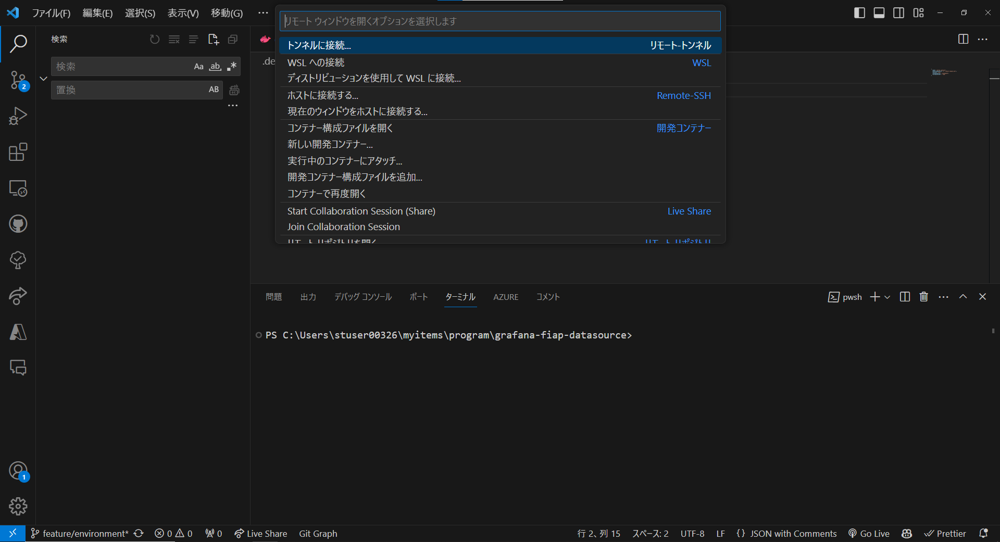
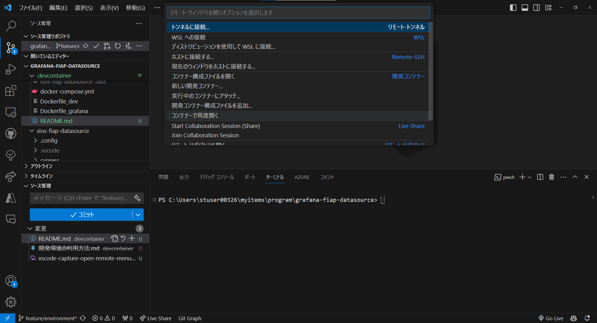
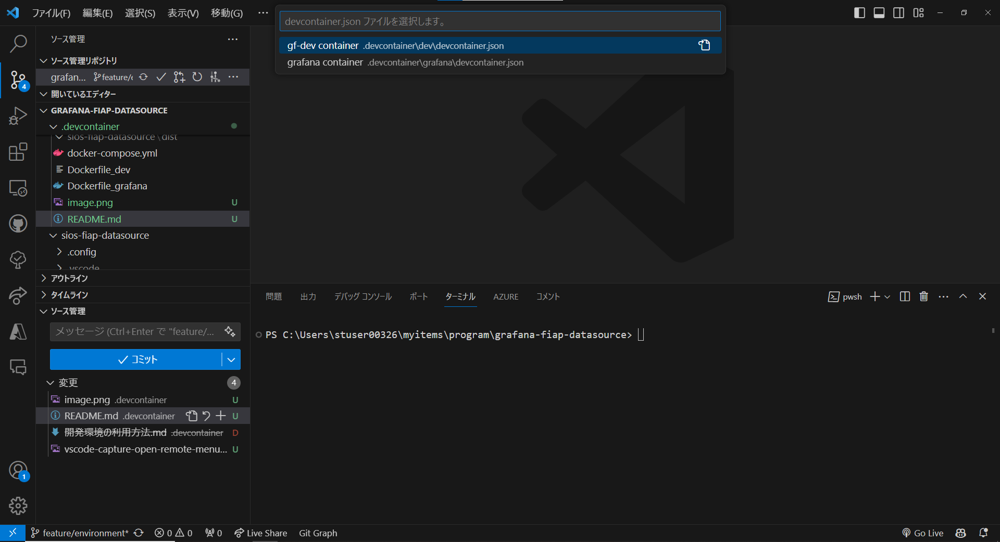

# 開発環境について

## devcontainerにより開発環境を開く
この環境では、vscodeのdevcontainerという機能を利用し、VS Codeでコンテナ内に入って作業することができる。
devcontainerの詳細については、[devcontainerを使用した開発についての公式ドキュメント](https://code.visualstudio.com/docs/devcontainers/containers)を参照すること。

### 前提
- Docker のインストール (Windows の場合は WSL2 上にインストール)
- Docker/Rancher Desktop for Windows/Mac のインストール
- VS Code のインストール
- VS Codeの拡張機能 - Dev Containers のインストール

コンテナの起動が成功することを確認しているバージョン
- Dev Containers - version 0.338.1
- VS Code - version 1.86.0
※ 筆者の環境では、VS Code と Dev Containersの環境が最新でない場合に、コンテナの起動が失敗する場合があった。

### 操作
- VS Codeで .devcontainerを含むディレクトリを開き、左下の「><」をクリックし、以下のメニューを表示する。

- 次に、[コンテナーで再度開く] を押下する。

- すると、以下のようにどのコンテナーの中に入るかを選択するメニューが表示される。プラグインの開発環境である[gf-dev container]と、grafanaのコンテナである[grafana container]が表示されるので、[gf-dev container]を選択し、開発環境の内部に入る。
- 

## grafana plugin開発での操作
- [gf-dev container]を起動し、新たなターミナルを開くと、コンテナ内の/appディレクトリが開く。
- `cd sios-fiap-datasource`コマンドで、grafana plguin開発用作業ディレクトリへ移動する。

### 開発時の操作
フロントエンドとバックエンドのビルドを行うためのコマンドは以下の通り。
※ビルドをGrafanaに反映させるためには、grafanaのserviceを再起動する必要がある。  
```bash
# 依存関係のインストール
npm install
# プラグインのフロントエンドをビルド(開発モード)
npm run dev
# プラグインのフロントエンドをビルド
npm run build
# 新しいターミナルで、バックエンドをビルドする
mage -v build:linux
```

### Grafanaの再起動方法
docker-compose.ymlの存在するディレクトリで、ターミナルから`docker compose restart grafana`を実行。 