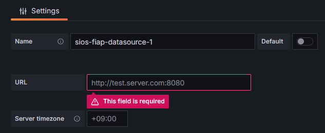
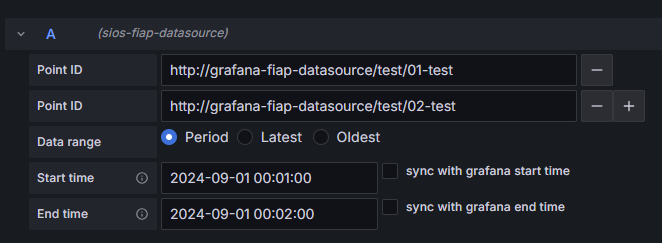

# FIAP data source plugin for Grafana

これはサーバからIEEE1888 プロトコルのFETCH メソッドでデータを取得し可視化するGrafana データソース プラグインです。

## What is IEEE1888?

IEEE1888 (UGCCNet, FIAPとも) は大量の時系列データをやりとりするための規格であり、BEMSやスマートグリッドでの利用を期待して開発されています。

## Usage

### Datasource Settings

| 設定項目        | 内容                                                                                                                        |
| --------------- | --------------------------------------------------------------------------------------------------------------------------- |
| Name            | データソース名 (Grafana内でのデータベースの識別に使用)                                                                      |
| Default         | ONの場合、このデータソースがデフォルトとしてダッシュボードに選択される                                                      |
| URL             | 接続先サーバのURIを、ポート番号を含む形式で入力                                                                             |
| Server timezone | FIAPサーバが特定のタイムゾーンの日付によるクエリのみ扱う場合は、そのタイムゾーンを`+09:00`の形式で入力   デフォルトはUTC |

### Query Settings

| 設定項目                         | 内容                                                                                                                                                                                                                                |
| -------------------------------- | ----------------------------------------------------------------------------------------------------------------------------------------------------------------------------------------------------------------------------------- |
| Point ID                         | FIAPのkeyクラスの`id`に対応   1行につき1つ入力                                                                                                                                                                                   |
| - Button                         | 押下した行のPoint ID欄を削除する                                                                                                                                                                                                    |
| + Button                         | 押下した行の1つ下方に新たなPoint ID欄を1つ挿入する                                                                                                                                                                                  |
| Data range                       | FIAPのkeyクラスの`select`に対応   Period、Latest、Oldestから1つ選択                                                                                                                                                              |
| Period                           | Start/End time欄で指定された時間範囲の時系列データを取得する (`select`指定なしに対応)                                                                                                                                               |
| Latest                           | Start/End time欄で指定された時間範囲内の最新データ1つを取得する (`select="maximum"`に対応)                                                                                                                                          |
| Oldest                           | Start/End time欄で指定された時間範囲内の最も古いデータ1つを取得する (`select="minimum"`に対応)                                                                                                                                      |
| Start/End time                   | それぞれFIAPのkeyクラスの`gteq`/`lteq`に対応   時間範囲の開始/終了を`2006-01-02 15:04:05`の形式で入力   時刻部分を省略すると`00:00:00`が補完される   [データソース設定](#datasource-settings)のServer timezoneが使用される |
| sync with grafana start/end time | チェックを入れると、時間範囲の開始/終了時刻がGrafana DashboardのTime Rangeと同期する   (Start/End timeの日付入力は無効化される)                                                                                                  |
